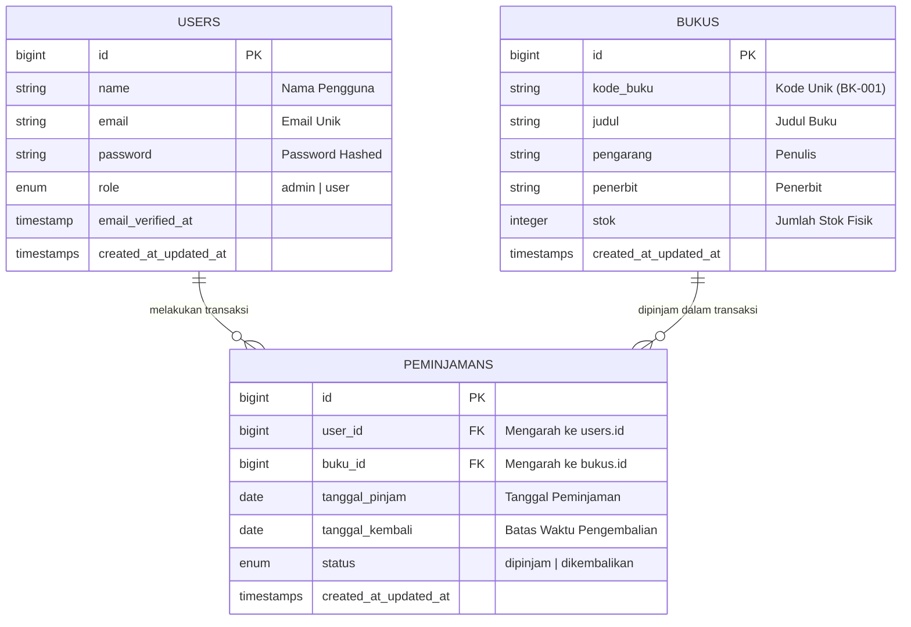

# 📚 Dokumentasi & Cara Kerja Sistem Informasi Perpustakaan Digital

Aplikasi web manajemen perpustakaan modern yang dibangun menggunakan framework **Laravel**, **Tailwind CSS**, dan **Alpine.js**. Aplikasi ini dirancang untuk memudahkan pengelolaan katalog buku, pencatatan transaksi peminjaman & pengembalian buku, otomatisasi stok buku, serta pemisahan hak akses antara **Administrator** dan **Siswa (Anggota)**.

---

## 📑 Daftar Isi
1. [Arsitektur & Konsep MVC](#-arsitektur--konsep-mvc)
2. [Struktur Basis Data & Relasi (ERD)](#-struktur-basis-data--relasi-erd)
3. [Alur & Logika Bisnis (Cara Kerja)](#-alur--logika-bisnis-cara-kerja)
4. [Daftar Akun Pengujian (Demo)](#-daftar-akun-pengujian-demo)
5. [Struktur Folder & Penjelasan File](#-struktur-folder--penjelasan-file)
6. [Panduan Menjalankan Proyek](#-panduan-menjalankan-proyek)

---

## 🏛️ Arsitektur & Konsep MVC

Aplikasi ini menggunakan pola arsitektur **Model-View-Controller (MVC)**:
- **Model (`app/Models/`)**: Mengatur representasi data tabel, relasi antar-entitas (Eloquent ORM), dan casting atribut.
- **View (`resources/views/`)**: Antarmuka pengguna (UI) yang dirender menggunakan Blade Templating Engine dan di-styling dengan Tailwind CSS.
- **Controller (`app/Http/Controllers/`)**: Menangani logika bisnis, memproses request HTTP, validasi input, memanipulasi database via Model, dan mengarahkan data ke View.
- **Routes (`routes/web.php` & `routes/auth.php`)**: Memetakan URL request ke Controller dan menerapkan middleware keamanan.

```
                  ┌────────────────┐
                  │    Browser     │
                  │ (HTTP Request) │
                  └───────┬────────┘
                          │
                          ▼
                  ┌────────────────┐
                  │  routes/web.php│ ◄── [Middleware Auth & Role]
                  └───────┬────────┘
                          │
                          ▼
            ┌───────────────────────────┐
            │        Controller         │
            │ (Buku, Peminjaman, User)  │
            └──────┬─────────────┬──────┘
                   │             │
        (Eloquent) │             │ (Kirim Data $compact)
                   ▼             ▼
          ┌─────────────┐   ┌─────────────┐
          │    Model    │   │  View/Blade │
          │  & Database │   │    (HTML)   │
          └─────────────┘   └─────────────┘
```

---

## 🗄️ Struktur Basis Data & Relasi (ERD)

Aplikasi memiliki 3 entitas utama yang saling terhubung:



### Penjelasan Relasi:
1. **User ke Peminjaman (`One-to-Many`)**:
   - 1 User (Siswa) dapat memiliki banyak riwayat transaksi peminjaman.
   - Didefinisikan dengan `$this->hasMany(Peminjaman::class)` di `User.php` dan `$this->belongsTo(User::class)` di `Peminjaman.php`.
2. **Buku ke Peminjaman (`One-to-Many`)**:
   - 1 Buku dapat dipinjam berulang kali dalam banyak transaksi.
   - Didefinisikan dengan `$this->hasMany(Peminjaman::class)` di `Buku.php` dan `$this->belongsTo(Buku::class)` di `Peminjaman.php`.

---

## ⚙️ Alur & Logika Bisnis (Cara Kerja)

### 1. Autentikasi & Otorisasi Multi-Role
- Saat pengguna login melalui form `/login`, Laravel mencocokkan email dan hash password.
- Jika berhasil, session dibuat dan role diperiksa:
  - **Jika Role = `admin`**: Diarahkan ke Dashboard Admin (`/admin/dashboard`). Admin memiliki menu: Kelola Buku, Kelola Anggota, dan Transaksi Peminjaman.
  - **Jika Role = `user`**: Diarahkan ke Dashboard Siswa (`/dashboard`). Siswa hanya dapat melihat katalog buku dan riwayat peminjaman miliknya sendiri.

### 2. Alur Transaksi Peminjaman (Stok Berkurang Otomatis)
1. Admin membuka halaman `/admin/peminjaman/create`.
2. Sistem hanya menampilkan buku yang memiliki **stok > 0** (`Buku::where('stok', '>', 0)`).
3. Admin memilih siswa peminjam, buku, tanggal pinjam, dan tanggal batas kembali (default +7 hari).
4. Saat formulir disubmit:
   - Sistem memvalidasi data dan memastikan stok buku masih tersedia.
   - Data transaksi dicatat di tabel `peminjamans` dengan status default **`dipinjam`**.
   - Stok buku bersangkutan **dikurangi 1** secara otomatis (`$buku->decrement('stok')`).

### 3. Alur Pengembalian Buku (Stok Bertambah Otomatis)
1. Admin melihat daftar transaksi di `/admin/peminjaman`.
2. Pada baris transaksi yang berstatus `dipinjam`, terdapat tombol **"Proses Kembali"**.
3. Admin mengklik tombol tersebut (mengirim request `PATCH` ke `/admin/peminjaman/{id}/kembali`).
4. Sistem memperbarui kolom status transaksi menjadi **`dikembalikan`**.
5. Stok buku bersangkutan **ditambah 1** kembali ke katalog (`$peminjaman->buku->increment('stok')`).

### 4. Proteksi Penghapusan Data
- Jika admin menghapus transaksi peminjaman saat statusnya masih `dipinjam`, sistem secara otomatis mengembalikan stok buku (+1) agar data fisik perpustakaan tidak hilang.
- Admin tidak dapat menghapus akunnya sendiri yang sedang aktif login untuk mencegah admin terkunci keluar (*lockout prevention*).

---

## 🔑 Daftar Akun Pengujian (Demo)

Gunakan kredensial berikut untuk menguji fitur aplikasi:

| Peran (Role) | Alamat Email | Kata Sandi (Password) | Hak Akses |
| :--- | :--- | :--- | :--- |
| **Administrator** | `admin@perpus.com` | `password123` | Akses penuh: Kelola Buku, Anggota, Transaksi, Pengembalian, dan Statistik. |
| **Siswa / Anggota** | `siswa@perpus.com` | `password123` | Akses terbatas: Melihat katalog buku dan memantau status peminjaman sendiri. |

---

## 📁 Struktur Folder & Penjelasan File

Berikut adalah file-file penting dan fungsinya di dalam proyek:

```
├── app/
│   ├── Http/
│   │   └── Controllers/
│   │       ├── Admin/
│   │       │   ├── BukuController.php         # CRUD data buku & validasi kode buku unik
│   │       │   ├── PeminjamanController.php   # Manajemen transaksi, auto-decrement/increment stok
│   │       │   └── UserController.php         # CRUD anggota/admin, hashing password, proteksi akun
│   │       ├── Auth/                          # Controller otentikasi bawaan Breeze (Login, Register, dll)
│   │       ├── Controller.php                 # Base Controller utama
│   │       └── ProfileController.php          # Manajemen profil pengguna
│   └── Models/
│       ├── Buku.php                           # Model tabel `bukus` & relasi peminjaman
│       ├── Peminjaman.php                     # Model tabel `peminjamans` & relasi ke user & buku
│       └── User.php                           # Model tabel `users` (Authenticatable) & role casting
│
├── database/
│   ├── migrations/
│   │   ├── 0001_01_01_000000_create_users_table.php       # Skema tabel users + kolom role
│   │   ├── 2026_08_19_044213_create_bukus_table.php       # Skema tabel bukus & stok
│   │   └── 2026_08_19_044214_create_peminjamen_table.php  # Skema tabel peminjamans & FK
│   └── seeders/
│       └── DatabaseSeeder.php                 # Data awal dummy (Akun admin, siswa, & buku)
│
├── resources/
│   └── views/
│       ├── admin/
│       │   ├── buku/                          # View index, create, edit data buku
│       │   ├── peminjaman/                    # View index & form transaksi peminjaman
│       │   ├── user/                          # View index, create, edit data anggota
│       │   └── dashboard.blade.php            # Dashboard statistik & metrik admin
│       ├── layouts/
│       │   ├── app.blade.php                  # Layout utama aplikasi
│       │   └── navigation.blade.php           # Navigasi responsif dinamis (Menu Admin vs Siswa)
│       ├── dashboard.blade.php                # Dashboard siswa (Status pinjaman & katalog buku)
│       └── welcome.blade.php                  # Landing page publik informasi perpustakaan
│
├── routes/
│   ├── web.php                                # Definisi rute aplikasi & proteksi role middleware
│   ├── auth.php                               # Definisi rute otentikasi login/register
│   └── console.php                            # Perintah command line Artisan
└── .env.example                               # Template konfigurasi environment (SQLite/MySQL)
```

---

## 🚀 Panduan Menjalankan Proyek

Ikuti langkah-langkah berikut untuk menjalankan aplikasi di komputer lokal:

### 1. Clone & Masuk ke Direktori Proyek
```bash
git clone <url-repository>
cd peminjamanperpus
```

### 2. Pasang Dependensi PHP (Composer) & Node.js (NPM)
```bash
composer install
npm install
```

### 3. Siapkan Konfigurasi Environment (`.env`)
Salin file `.env.example` menjadi `.env`:
```bash
cp .env.example .env
```
Lalu generate encryption key Laravel:
```bash
php artisan key:generate
```

### 4. Jalankan Migrasi Basis Data & Seeder
Buat tabel dan isi dengan data akun demo:
```bash
php artisan migrate:fresh --seed
```

### 5. Jalankan Server Pengembangan
Buka 2 terminal terpisah:

**Terminal 1 (Backend Laravel):**
```bash
php artisan serve
```

**Terminal 2 (Frontend Vite Asset Compiler):**
```bash
npm run dev
```

### 6. Buka Aplikasi di Browser
Kunjungi URL: **[http://127.0.0.1:8000](http://127.0.0.1:8000)** di peramban web Anda.
- Klik **Log in** menggunakan akun `admin@perpus.com` (Password: `password123`) untuk menguji fitur Admin.
- Klik **Log in** menggunakan akun `siswa@perpus.com` (Password: `password123`) untuk menguji fitur Siswa.
